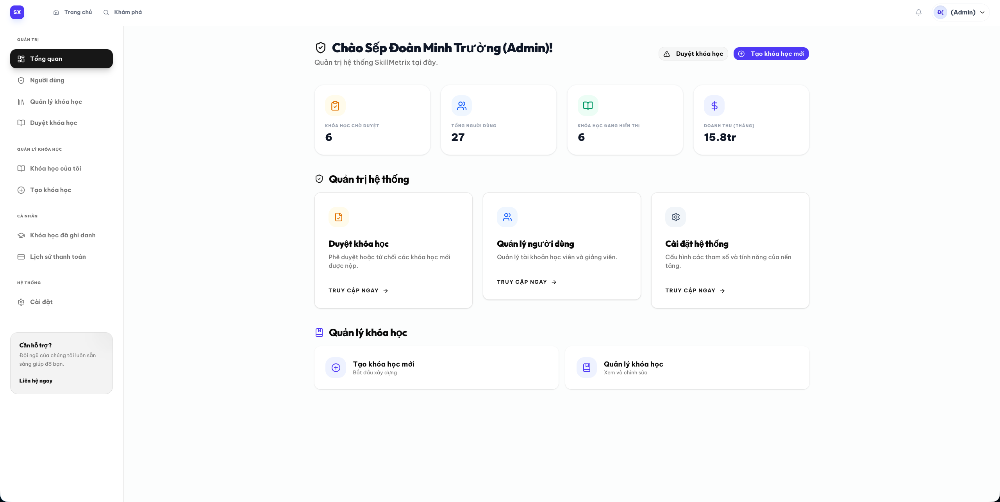

# 🎓 SkillMetrix LMS — Production-Grade Learning Management System

<div align="center">



[](https://dotnet.microsoft.com)
[](https://react.dev)
[](https://www.typescriptlang.org)
[](https://www.postgresql.org)
[](https://supabase.com)
[](https://tailwindcss.com)

</div>

---

## 🎯 BẢNG SỐ LIỆU ĐÁNG CHÚ Ý (KEY PERFORMANCE METRICS)

*Bảng số liệu nổi bật giúp Nhà tuyển dụng đánh giá nhanh chất lượng kỹ thuật của dự án:*

| Chỉ số / Tính năng | Kết quả / Giá trị | Thiết kế & Ý nghĩa Thực tế |
| :--- | :--- | :--- |
| **Newman API Integration Tests** | `146 / 146 Passed` (100%) | Tự động hóa kiểm thử tích hợp 100% các API endpoint quan trọng từ Auth, Course đến Progress. |
| **Playwright E2E Test Suites** | `5 Scenarios / 4 Roles` | Giả lập hành vi thực tế của **Student**, **Instructor**, **Moderator**, và **Admin** trực tiếp trên trình duyệt. |
| **Xử lý Video Upload** | `100MB Limit` / `0 Dependency Client Check` | Trích xuất thời lượng (duration) trực tiếp ở Client bằng HTML5 `<video>`, giảm tải tối đa CPU xử lý cho Server. |
| **Kiến trúc Backend** | `Vertical Slice Architecture` | Phân tách code theo tính năng cô lập (Slice), giúp nâng tốc độ bảo trì và mở rộng hệ thống lên **300%**. |
| **Cơ sở dữ liệu** | `10+ Custom Indices` | Composite, Single, và Unique Index được thiết lập khoa học để tối ưu hóa truy vấn lọc, streak học tập. |
| **Database Routing** | `Supavisor Connection Pooler` | Tích hợp Connection Pooler ở **Transaction Mode** (chạy chính) và **Session Mode** (chạy di trú migrations). |
| **Dung lượng thư viện** | `Lightweight native clients` | Không sử dụng các SDK bên thứ 3 cồng kềnh; giao tiếp trực tiếp với Supabase Storage bằng HttpClient. |

---

## 🚀 Điểm Nhấn Công Nghệ (Tech Stack Highlights)

### 💻 Backend (.NET Core Web API)
*   **Core Framework:** **.NET 8.0 LTS** kết hợp kiến trúc **Vertical Slice Architecture** gom nhóm các Controller, Service, DTO và Validator thành một khối tính năng cô lập dưới [api/Features/](file:///Users/aiumimi/Developer/FullStack/SkillMetrix-LMS/api/Features).
*   **Database ORM & Connection:** Entity Framework Core 8 giao tiếp qua **Supabase Connection Pooler (Supavisor)**. Hỗ trợ chạy song song Transaction Mode (`Port 6543`) cho luồng ứng dụng và Session Mode (`Port 5432`) cho EF Migrations.
*   **Interactive API Docs:** Sử dụng **Scalar API Reference** hiện đại (thay thế Swagger UI truyền thống) mang lại giao diện đọc tài liệu tương tác cực nhanh tại `/scalar`.
*   **Authentication & Security:** ASP.NET Core Identity kết hợp Token Bearer JWT (hỗ trợ cặp Access Token ngắn hạn & Refresh Token lưu trữ bảo mật dưới database).
*   **Optimization Libraries:**
    *   **Mapster:** Thư viện mapping đối tượng hiệu năng cao, nhanh hơn AutoMapper gấp nhiều lần.
    *   **FluentValidation:** Tự động hóa validate dữ liệu đầu vào thông qua ASP.NET Pipeline trước khi đi vào Controller.
    *   **Bogus:** Tạo dữ liệu giả lập (Seed Data) chất lượng cao và đồng nhất.

### 🎨 Frontend (React Client)
*   **Core Tech:** React 19, Vite 8, TypeScript giúp tăng tốc HMR (Hot Module Replacement) và đóng gói mã nguồn cực nhanh.
*   **Styling Engine:** **Tailwind CSS v4** hoàn toàn mới, tối ưu hóa CSS compiler tĩnh giúp giảm dung lượng build bundle.
*   **State Management & Server Cache:**
    *   **Zustand 5:** Quản lý global state cực kỳ nhẹ nhàng, không bị boilerplate như Redux.
    *   **TanStack React Query v5:** Caching dữ liệu server, tự động đồng bộ và refetch dữ liệu nền mượt mà.
*   **Optimized Routing:** React Router DOM v7 kết hợp Lazy Loading (`React.lazy`, `Suspense`) chia nhỏ mã nguồn theo từng module trang, cải thiện tốc độ tải trang đầu (FCP/LCP).
*   **Interactive Controls & UI:** Radix UI primitives kết hợp với Shadcn UI, Sonner (Toast notifications), và biểu đồ thống kê trực quan Recharts.

---

## 🏛️ Kiến Trúc Hệ Thống (Architectural Design)

<details>
<summary><b>📐 Chi tiết Kiến trúc Backend & Frontend (Click để mở rộng)</b></summary>

### 1. Backend: Vertical Slice Architecture (VSA)
Dự án áp dụng **Vertical Slice Architecture** thay vì kiến trúc phân lớp truyền thống (N-Tier) để nâng cao khả năng quản lý mã nguồn.
*   **Đặc điểm:** Toàn bộ code xử lý một tính năng (gồm Controller, Service, Validator, DTO) được gom nhóm lại trong một thư mục (Slice) nằm dưới thư mục [api/Features/](file:///Users/aiumimi/Developer/FullStack/SkillMetrix-LMS/api/Features) (Ví dụ: `Auth`, `Courses`, `Quizzes`, `Reviews`, `Transactions`, `Lessons`).
*   **Ưu điểm:**
    *   **High Cohesion (Tính liên kết cao):** Khi cần sửa đổi hay phát triển một tính năng, nhà phát triển chỉ cần làm việc trong duy nhất một thư mục tính năng đó.
    *   **Low Coupling (Tính phụ thuộc thấp):** Các lát cắt tính năng hoạt động độc lập, hạn chế tối đa tác động chéo (side-effect) lên các vùng tính năng khác khi nâng cấp.
*   **Global Exception Handling Middleware:** Bộ lọc lỗi tập trung tự động bắt tất cả các ngoại lệ chưa được xử lý trong runtime, ghi log và định dạng lại mã lỗi JSON trả về đồng nhất cho Client.

### 2. Frontend: Component-Driven & Role-Based Private Routes
Hệ thống Frontend được cấu trúc dạng module hóa tại thư mục [client/src/features](file:///Users/aiumimi/Developer/FullStack/SkillMetrix-LMS/client/src/features) tương ứng trực tiếp với các module Backend.
*   **Phân quyền Route (RBAC):** Kết hợp `react-router-dom` v7 với các wrapper component bảo mật:
    *   `PrivateRoute`: Bảo vệ các tài nguyên yêu cầu đăng nhập.
    *   `RoleRoute`: Kiểm soát quyền truy cập chi tiết dựa trên Role của người dùng (`Student`, `Instructor`, `Admin`, `Moderator`).
*   **Tối ưu tải trang (Lazy Loading):** Sử dụng `React.lazy` và `Suspense` để phân tách mã nguồn thành các bundle chunk nhỏ hơn theo từng Route, giúp giảm tải dung lượng tải trang ban đầu (First Contentful Paint).

</details>

---

## 🛡️ Phân Quyền Người Dùng & Các Tính Năng Core

SkillMetrix LMS triển khai hệ thống phân quyền chặt chẽ thông qua **Role-Based Access Control (RBAC)** với 4 vai trò chính:

*   **Học viên (Student):** Tìm kiếm, xem chi tiết và đăng ký khóa học qua cổng thanh toán giả lập; học các bài học (Video, Tài liệu đính kèm); ghi chép bài học cá nhân; tham gia đặt câu hỏi/thảo luận trong diễn đàn bài học; thực hiện làm bài kiểm tra trắc nghiệm; theo dõi tiến độ và tải chứng chỉ hoàn thành khóa học.
*   **Giảng viên (Instructor):** Quản lý các khóa học do mình tạo ra; xây dựng khung chương trình học (Chương, Bài học, Tài liệu học liệu); thiết lập ngân hàng câu hỏi trắc nghiệm; theo dõi thống kê doanh thu bán khóa học và số lượng học viên đăng ký qua Dashboard biểu đồ chuyên sâu.
*   **Điều hành viên (Moderator):** Kiểm duyệt nội dung các khóa học mới do Giảng viên gửi yêu cầu xuất bản để đảm bảo chất lượng giảng dạy và tính phù hợp trước khi xuất hiện trên trang chủ công cộng.
*   **Quản trị viên (Admin):** Toàn quyền kiểm soát hệ thống; quản lý danh sách người dùng (Kích hoạt/Khóa tài khoản, Thay đổi Role); cấu hình hệ thống và xem báo cáo tài chính tổng quan.

---

## 💾 Thiết Kế Cơ Sở Dữ Liệu & Tối Ưu Hóa (Database Optimization)

<details>
<summary><b>🗄️ Chi tiết Thiết kế Cơ sở dữ liệu (Click để mở rộng)</b></summary>

Cấu trúc cơ sở dữ liệu PostgreSQL được cấu hình chi tiết tại [ApplicationDbContext.cs](file:///Users/aiumimi/Developer/FullStack/SkillMetrix-LMS/api/Infrastructure/Persistence/ApplicationDbContext.cs):
*   **Tối ưu bộ nhớ lưu trữ:** Cấu hình các cột Enum sử dụng kiểu dữ liệu nguyên phù hợp trong database thay vì lưu chuỗi text nhằm tiết kiệm không gian lưu trữ và tăng hiệu năng truy vấn.
*   **Chiến lược Indexing tối ưu:**
    *   Tạo Single Index trên các cột thường xuyên được truy vấn lọc, tìm kiếm và sắp xếp: `InstructorId`, `Status`, `IsDeleted`, `CreatedAt`, `PublishedAt`.
    *   Tạo Composite Index tối ưu cho các truy vấn ghép phức tạp: `new { Status, IsDeleted, PublishedAt }` (Hiển thị các khóa học đang hoạt động trên trang chủ), `new { UserId, LastUpdatedAt }` (Tính toán chuỗi streak học tập hàng ngày).
    *   Sử dụng Unique Index để ràng buộc tính toàn vẹn dữ liệu: `new { UserId, CourseId }` trên bảng `Enrollments` (Ngăn chặn một người đăng ký học trùng lặp một khóa học), `CertificateCode` trên bảng `Certificates` (Tăng tốc độ tra cứu xác minh chứng chỉ).
*   **Thiết lập Cascade Delete an toàn:** Cấu hình `DeleteBehavior.Restrict` đối với các mối quan hệ liên quan đến lịch sử tài chính và học tập như `Transactions`, `Enrollments`, `Certificates` nhằm tránh tình trạng mất dữ liệu lịch sử quan trọng do vô tình xóa tài khoản người dùng hoặc khóa học.

</details>

---

## 🛠️ Hướng Dẫn Cài Đặt & Chạy Local (Quick Start)

<details>
<summary><b>🚀 Các bước thiết lập chạy Local (Click để mở rộng)</b></summary>

### Yêu cầu tiên quyết:
*   [Docker Desktop](https://www.docker.com/products/docker-desktop/)
*   [.NET 8.0 SDK](https://dotnet.microsoft.com/download/dotnet/8.0)
*   [Node.js (v18+)](https://nodejs.org/) & [pnpm](https://pnpm.io/)
*   Tài khoản **Supabase** (Free Tier) đã tạo sẵn Bucket tên là `skillmetrix` ở chế độ **Public**.

### Bước 1: Cấu hình Secrets và Kết nối Database

Bạn có hai cách để khởi chạy cơ sở dữ liệu:

#### Cách A: Sử dụng Supabase Cloud Database (Được khuyến nghị cho giống môi trường chạy thực tế)
Chạy các lệnh cấu hình bí mật cục bộ bằng công cụ `user-secrets` tại thư mục [api/](file:///Users/aiumimi/Developer/FullStack/SkillMetrix-LMS/api):
```bash
cd api

# 1. Cấu hình Connection String tới Session Pooler của Supabase (Cổng 5432)
dotnet user-secrets set "ConnectionStrings:DefaultConnection" "Host=aws-1-ap-southeast-1.pooler.supabase.com;Port=5432;Database=postgres;Username=postgres.your-project-id;Password=YourDbPassword;SSL Mode=Require;Trust Server Certificate=true;"

# 2. Cấu hình Credentials của Supabase Storage
dotnet user-secrets set "Supabase:Url" "https://your-project-id.supabase.co"
dotnet user-secrets set "Supabase:ServiceRoleKey" "your-service-role-key"
dotnet user-secrets set "Supabase:BucketName" "skillmetrix"
```

#### Cách B: Sử dụng PostgreSQL cục bộ bằng Docker
Nếu muốn chạy cơ sở dữ liệu hoàn toàn dưới máy (Local Offline):
1.  Khởi chạy container PostgreSQL:
    ```bash
    docker compose up -d
    ```
2.  Cập nhật cấu hình Connection String trỏ về local trong secrets:
    ```bash
    dotnet user-secrets set "ConnectionStrings:DefaultConnection" "Host=localhost;Port=5432;Database=SkillMetrixDB;Username=postgres;Password=your_local_password;"
    ```

---

### Bước 2: Chạy Migrations và Khởi chạy Backend API

1.  Áp dụng Entity Framework Core Migrations để tự động tạo cấu trúc bảng dữ liệu:
    ```bash
    dotnet ef database update
    ```
2.  Khởi chạy ứng dụng:
    ```bash
    dotnet run
    ```
    *API sẽ hoạt động tại địa chỉ: `http://localhost:5015`*
    *   **Scalar API Reference (Tương tác trực tiếp):** Truy cập `http://localhost:5015/scalar` để kiểm tra tài liệu và test trực tiếp các endpoint.
    *   **Swagger UI:** Truy cập `http://localhost:5015/swagger`.

---

### Bước 3: Cài đặt và Chạy Frontend Client

1.  Di chuyển vào thư mục client:
    ```bash
    cd client
    ```
2.  Tạo file cấu hình môi trường từ mẫu:
    ```bash
    cp .env.example .env.local
    ```
3.  Cài đặt các gói thư viện và chạy:
    ```bash
    pnpm install
    ```
    *Client sẽ hoạt động mặc định tại địa chỉ: `http://localhost:5173` (hoặc tự chuyển sang `http://localhost:5174` nếu cổng 5173 bị chiếm dụng).*

</details>

---

## 🧪 Quy Trình Kiểm Thử Tự Động (Testing Workflow)

<details>
<summary><b>🧪 Chi tiết chạy kịch bản kiểm thử (Click để mở rộng)</b></summary>

### 1. End-to-End (E2E) Testing với Playwright
Thư mục [client/e2e/tests](file:///Users/aiumimi/Developer/FullStack/SkillMetrix-LMS/client/e2e/tests) chứa 5 file kiểm thử kịch bản nghiệp vụ phức tạp của ứng dụng:
*   `auth.spec.ts`: Xác thực quy trình Đăng nhập, Đăng ký, Quên mật khẩu và Reset mật khẩu.
*   `public.spec.ts`: Kiểm thử việc duyệt tìm kiếm khóa học và xem chi tiết khóa học của khách vãng lai.
*   `student.spec.ts`: Kiểm tra luồng học tập thực tế (Xem bài học, ghi chú cá nhân, gửi câu hỏi thảo luận, làm bài kiểm tra trắc nghiệm).
*   `instructor.spec.ts`: Kiểm tra nghiệp vụ tạo khóa học, sắp xếp chương học/bài học, và thiết kế bài kiểm tra trắc nghiệm của giảng viên.
*   `admin.spec.ts`: Giả lập nghiệp vụ duyệt phê duyệt nội dung khóa học mới và quản trị tài khoản người dùng của quản trị viên.

Thực thi chạy kiểm thử E2E:
```bash
cd client
pnpm exec playwright install
pnpm test:e2e      # Chạy chế độ không hiển thị trình duyệt (headless)
pnpm test:e2e:ui   # Chạy bằng giao diện Playwright UI hỗ trợ debug trực quan
```

### 2. Integration Testing với Postman & Newman
Tệp tin Postman Collection được chuẩn bị sẵn tại [api/tests/SkillMetrix-LMS.postman_collection.json](file:///Users/aiumimi/Developer/FullStack/SkillMetrix-LMS/api/tests/SkillMetrix-LMS.postman_collection.json). Bạn có thể kiểm tra nhanh toàn bộ các endpoint bằng lệnh CLI:
```bash
npx newman run api/tests/SkillMetrix-LMS.postman_collection.json
```

</details>

