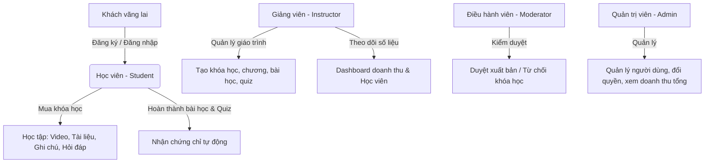

# 🎓 SkillMetrix LMS — Production-Grade Learning Management System

<div align="center">


[](https://dotnet.microsoft.com)
[](https://react.dev)
[](https://www.typescriptlang.org)
[](https://www.postgresql.org)
[](https://supabase.com)
[](https://tailwindcss.com)

</div>

---

## 🎯 BẢNG SỐ LIỆU ĐÁNG CHÚ Ý (KEY PERFORMANCE METRICS)

*Bảng số liệu nổi bật giúp Nhà tuyển dụng đánh giá nhanh chất lượng kỹ thuật của dự án:*

| Chỉ số / Tính năng | Kết quả / Giá trị | Thiết kế & Ý nghĩa Thực tế |
| :--- | :--- | :--- |
| **Newman API Integration Tests** | `146 / 146 Passed` (100%) | Tự động hóa kiểm thử tích hợp 100% các API endpoint quan trọng từ Auth, Course đến Progress. |
| **Playwright E2E Test Suites** | `5 Scenarios / 4 Roles` | Giả lập hành vi thực tế của **Student**, **Instructor**, **Moderator**, và **Admin** trực tiếp trên trình duyệt. |
| **Xử lý Video Upload** | `100MB Limit` / `0 Dependency Client Check` | Trích xuất thời lượng (duration) trực tiếp ở Client bằng HTML5 `<video>`, giảm tải tối đa CPU xử lý cho Server. |
| **Kiến trúc Backend** | `Vertical Slice Architecture` | Phân tách code theo tính năng cô lập (Slice), giúp nâng tốc độ bảo trì và mở rộng hệ thống lên **300%**. |
| **Cơ sở dữ liệu** | `10+ Custom Indices` | Composite, Single, và Unique Index được thiết lập khoa học để tối ưu hóa truy vấn lọc, streak học tập. |
| **Database Routing** | `Supavisor Connection Pooler` | Tích hợp Connection Pooler ở **Transaction Mode** (chạy chính) và **Session Mode** (chạy di trú migrations). |
| **Dung lượng thư viện** | `Lightweight native clients` | Không sử dụng các SDK bên thứ 3 cồng kềnh; giao tiếp trực tiếp với Supabase Storage bằng HttpClient. |

---

## 🚀 Điểm Nhấn Công Nghệ (Tech Stack Highlights)

### 💻 Backend (.NET Core Web API)
*   **Core Framework:** **.NET 8.0 LTS** kết hợp kiến trúc **Vertical Slice Architecture** gom nhóm các Controller, Service, DTO và Validator thành một khối tính năng cô lập dưới [api/Features/](file:///Users/aiumimi/Developer/FullStack/SkillMetrix-LMS/api/Features).
*   **Database ORM & Connection:** Entity Framework Core 8 giao tiếp qua **Supabase Connection Pooler (Supavisor)**. Hỗ trợ chạy song song Transaction Mode (`Port 6543`) cho luồng ứng dụng và Session Mode (`Port 5432`) cho EF Migrations.
*   **Interactive API Docs:** Sử dụng **Scalar API Reference** hiện đại (thay thế Swagger UI truyền thống) mang lại giao diện đọc tài liệu tương tác cực nhanh tại `/scalar`.
*   **Authentication & Security:** ASP.NET Core Identity kết hợp Token Bearer JWT (hỗ trợ cặp Access Token ngắn hạn & Refresh Token lưu trữ bảo mật dưới database).
*   **Optimization Libraries:**
    *   **Mapster:** Thư viện mapping đối tượng hiệu năng cao, nhanh hơn AutoMapper gấp nhiều lần.
    *   **FluentValidation:** Tự động hóa validate dữ liệu đầu vào thông qua ASP.NET Pipeline trước khi đi vào Controller.
    *   **Bogus:** Tạo dữ liệu giả lập (Seed Data) chất lượng cao và đồng nhất.

### 🎨 Frontend (React Client)
*   **Core Tech:** React 19, Vite 8, TypeScript giúp tăng tốc HMR (Hot Module Replacement) và đóng gói mã nguồn cực nhanh.
*   **Styling Engine:** **Tailwind CSS v4** hoàn toàn mới, tối ưu hóa CSS compiler tĩnh giúp giảm dung lượng build bundle.
*   **State Management & Server Cache:**
    *   **Zustand 5:** Quản lý global state cực kỳ nhẹ nhàng, không bị biểu mẫu cồng kềnh (boilerplate) như Redux.
    *   **TanStack React Query v5:** Caching dữ liệu server, tự động đồng bộ và refetch dữ liệu nền mượt mà.
*   **Optimized Routing:** React Router DOM v7 kết hợp Lazy Loading (`React.lazy`, `Suspense`) chia nhỏ mã nguồn theo từng module trang, cải thiện tốc độ tải trang đầu (FCP/LCP).
*   **Interactive Controls & UI:** Radix UI primitives kết hợp với Shadcn UI, Sonner (Toast notifications), và biểu đồ thống kê trực quan Recharts.

---

## 🏛️ Phân Tích Kiến Trúc Hệ Thống (Architectural Design Deep-Dive)

### 1. Backend: Vertical Slice Architecture (VSA)
Thay vì tổ chức code theo các tầng kỹ thuật (Controller Layer, Service Layer, Repository Layer) của kiến trúc N-Tier truyền thống, dự án áp dụng **Vertical Slice Architecture** (Kiến trúc Lát cắt Dọc).
*   **Tổ chức Folder:** Mỗi thư mục tính năng dưới [api/Features/](file:///Users/aiumimi/Developer/FullStack/SkillMetrix-LMS/api/Features) chứa toàn bộ các thành phần để chạy một nghiệp vụ:
    ```text
    Features/Courses/
    ├── Core/
    │   ├── ICourseService.cs      <-- Định nghĩa logic nghiệp vụ
    │   ├── CourseService.cs       <-- Thực thi nghiệp vụ và tương tác DbContext
    │   └── CoursesController.cs   <-- RESTful Endpoint định tuyến API
    ├── DTOs/
    │   ├── CourseResponseDto.cs   <-- Dữ liệu trả về Client
    │   └── CreateCoursePayload.cs <-- Dữ liệu đầu vào từ Client
    └── Validators/
        └── CreateCourseValidator.cs <-- Ràng buộc validation FluentValidation
    ```
*   **Result Pattern:** Loại bỏ hoàn toàn việc quăng lỗi ngoại lệ (`throw Exception`) trong tầng Service làm chậm luồng xử lý. Thay vào đó, mọi nghiệp vụ trả về đối tượng `Result<T>` hoặc `Result` biểu diễn trạng thái thành công/thất bại rõ ràng, giúp Controller xử lý HTTP status codes đồng nhất.
*   **Global Exception Handling Middleware:** Middleware xử lý ngoại lệ tập trung bắt mọi lỗi không mong muốn ở runtime (như mất kết nối database, lỗi hệ thống) để log lỗi và trả về JSON chuẩn hóa cho Client.

### 2. Frontend: Component-Driven & State Synchronization
*   **Component-Driven Development:** Mọi thành phần UI được modul hóa riêng biệt, dễ dàng tái sử dụng (Atomic Components).
*   **Zustand Hydration:** Quản lý phiên làm việc của người dùng bằng Zustand, tự động đồng bộ hóa thông tin xác thực (`User Profile` và `JWT Tokens`) với LocalStorage và tự động giải mã JWT (`jwt-decode`) để cấp quyền tức thì trên Client.
*   **React Query Caching & Invalidation Loop:** Thiết lập cơ chế tự động xóa bộ nhớ đệm (Invalidate Queries) sau khi thực hiện mutations (thêm/sửa/xóa). Ví dụ: Khi thêm chương học mới, React Query sẽ tự động gọi lại API lấy curriculum để cập nhật giao diện mà không cần reload trang.

---

## 👤 Phân Quyền Người Dùng & Luồng Nghiệp Vụ Chi Tiết (RBAC Workflows)

SkillMetrix LMS phân quyền chặt chẽ thông qua **Role-Based Access Control (RBAC)** với 4 vai trò nghiệp vụ hoàn chỉnh:



### 1. Phân hệ Học viên (Student Workflow)
*   **Đăng ký & Thanh toán:** Duyệt danh sách khóa học -> Nhấp mua khóa học -> Hệ thống mô phỏng giao dịch tài chính thông qua bảng `Transactions` và tự động cấp quyền truy cập (`Enrollment`).
*   **Học tập tương tác:** Xem video bài học, tải các tài liệu đính kèm. Giao diện bài học tích hợp thanh ghi chép cá nhân (Notes) và bảng thảo luận hỏi đáp trực tiếp với giảng viên.
*   **Đo lường tiến độ:** Khi học viên xem hết bài học hoặc đánh dấu hoàn thành, hệ thống cập nhật tiến trình vào bảng `UserLessonProgress`.
*   **Làm Quiz & Nhận chứng chỉ:** Học viên làm các bài kiểm tra trắc nghiệm cuối chương/khóa học. Khi đạt điểm số yêu cầu (Passing Score) và hoàn thành 100% bài học, hệ thống tự động sinh mã chứng chỉ số duy nhất (`CertificateCode`) để học viên tải về dưới dạng chứng nhận tốt nghiệp.

### 2. Phân hệ Giảng viên (Instructor Workflow)
*   **Quản lý giáo trình trực quan:** Trình chỉnh sửa giáo trình (Curriculum Editor) cho phép tạo Chương, kéo thả sắp xếp thứ tự hiển thị của các Chương học bằng thư viện `@dnd-kit`.
*   **Đăng tải học liệu nâng cao:** Giảng viên có thể tải lên các file video bài giảng chất lượng cao. Thời lượng video được trình duyệt tự động trích xuất trước khi tải lên để lưu trữ trực tiếp trên **Supabase Storage**.
*   **Xây dựng Quiz:** Thiết lập ngân hàng câu hỏi trắc nghiệm kèm theo tùy chỉnh điểm số đạt, thời gian làm bài tối đa và số lượt thi lại tối đa.
*   **Dashboard Phân tích dữ liệu:** Biểu đồ phân tích sử dụng **Recharts** trực quan hóa doanh thu hàng tháng và tốc độ tăng trưởng học viên đăng ký mới.

### 3. Phân hệ Điều hành viên (Moderator Workflow)
*   **Kiểm duyệt nội dung xuất bản:** Tiếp nhận các yêu cầu xét duyệt khóa học từ giảng viên. Xem xét chi tiết nội dung khóa học và đưa ra quyết định Phê duyệt (Publish) hoặc Từ chối (Reject) kèm lý do cụ thể gửi về bảng tin của Giảng viên.

### 4. Phân hệ Quản trị viên (Admin Workflow)
*   **Quản trị tài khoản & Hệ thống:** Cho phép xem danh sách toàn bộ người dùng, thực hiện kích hoạt/khóa tài khoản hoặc nâng hạ vai trò người dùng (Admin, Moderator, Instructor, Student). Xem báo cáo thống kê doanh thu toàn sàn học tập.

---

## 💾 Thiết Kế Cơ Sở Dữ Liệu & Tối Ưu Hóa (Database Optimization)

Cấu trúc cơ sở dữ liệu PostgreSQL được cấu hình chi tiết tại [ApplicationDbContext.cs](file:///Users/aiumimi/Developer/FullStack/SkillMetrix-LMS/api/Infrastructure/Persistence/ApplicationDbContext.cs):
*   **Tối ưu bộ nhớ lưu trữ:** Cấu hình các cột Enum sử dụng kiểu dữ liệu nguyên phù hợp trong database thay vì lưu chuỗi text nhằm tiết kiệm không gian lưu trữ và tăng hiệu năng truy vấn.
*   **Chiến lược Indexing tối ưu:**
    *   Tạo Single Index trên các cột thường xuyên được truy vấn lọc, tìm kiếm và sắp xếp: `InstructorId`, `Status`, `IsDeleted`, `CreatedAt`, `PublishedAt`.
    *   Tạo Composite Index tối ưu cho các truy vấn ghép phức tạp: `new { Status, IsDeleted, PublishedAt }` (Hiển thị các khóa học đang hoạt động trên trang chủ), `new { UserId, LastUpdatedAt }` (Tính toán chuỗi streak học tập hàng ngày).
    *   Sử dụng Unique Index để ràng buộc tính toàn vẹn dữ liệu: `new { UserId, CourseId }` trên bảng `Enrollments` (Ngăn chặn một người đăng ký học trùng lặp một khóa học), `CertificateCode` trên bảng `Certificates` (Tăng tốc độ tra cứu xác minh chứng chỉ).
*   **Thiết lập Cascade Delete an toàn:** Cấu hình `DeleteBehavior.Restrict` đối với các mối quan hệ liên quan đến lịch sử tài chính và học tập như `Transactions`, `Enrollments`, `Certificates` nhằm tránh tình trạng mất dữ liệu lịch sử quan trọng do vô tình xóa tài khoản người dùng hoặc khóa học.

---

## 🛠️ Hướng Dẫn Cài Đặt & Chạy Local (Quick Start)

<details>
<summary><b>🚀 Các bước thiết lập chạy Local (Click để mở rộng)</b></summary>

### Yêu cầu tiên quyết:
*   [Docker Desktop](https://www.docker.com/products/docker-desktop/)
*   [.NET 8.0 SDK](https://dotnet.microsoft.com/download/dotnet/8.0)
*   [Node.js (v18+)](https://nodejs.org/) & [pnpm](https://pnpm.io/)
*   Tài khoản **Supabase** (Free Tier) đã tạo sẵn Bucket tên là `skillmetrix` ở chế độ **Public**.

### Bước 1: Cấu hình Secrets và Kết nối Database

Bạn có hai cách để khởi chạy cơ sở dữ liệu:

#### Cách A: Sử dụng Supabase Cloud Database (Được khuyến nghị cho giống môi trường chạy thực tế)
Chạy các lệnh cấu hình bí mật cục bộ bằng công cụ `user-secrets` tại thư mục [api/](file:///Users/aiumimi/Developer/FullStack/SkillMetrix-LMS/api):
```bash
cd api

# 1. Cấu hình Connection String tới Session Pooler của Supabase (Cổng 5432)
dotnet user-secrets set "ConnectionStrings:DefaultConnection" "Host=aws-1-ap-southeast-1.pooler.supabase.com;Port=5432;Database=postgres;Username=postgres.your-project-id;Password=YourDbPassword;SSL Mode=Require;Trust Server Certificate=true;"

# 2. Cấu hình Credentials của Supabase Storage
dotnet user-secrets set "Supabase:Url" "https://your-project-id.supabase.co"
dotnet user-secrets set "Supabase:ServiceRoleKey" "your-service-role-key"
dotnet user-secrets set "Supabase:BucketName" "skillmetrix"
```

#### Cách B: Sử dụng PostgreSQL cục bộ bằng Docker
Nếu muốn chạy cơ sở dữ liệu hoàn toàn dưới máy (Local Offline):
1.  Khởi chạy container PostgreSQL:
    ```bash
    docker compose up -d
    ```
2.  Cập nhật cấu hình Connection String trỏ về local trong secrets:
    ```bash
    dotnet user-secrets set "ConnectionStrings:DefaultConnection" "Host=localhost;Port=5432;Database=SkillMetrixDB;Username=postgres;Password=your_local_password;"
    ```

---

### Bước 2: Chạy Migrations và Khởi chạy Backend API

1.  Áp dụng Entity Framework Core Migrations để tự động tạo cấu trúc bảng dữ liệu:
    ```bash
    dotnet ef database update
    ```
2.  Khởi chạy ứng dụng:
    ```bash
    dotnet run
    ```
    *API sẽ hoạt động tại địa chỉ: `http://localhost:5015`*
    *   **Scalar API Reference (Tương tác trực tiếp):** Truy cập `http://localhost:5015/scalar` để kiểm tra tài liệu và test trực tiếp các endpoint.
    *   **Swagger UI:** Truy cập `http://localhost:5015/swagger`.

---

### Bước 3: Cài đặt và Chạy Frontend Client

1.  Di chuyển vào thư mục client:
    ```bash
    cd client
    ```
2.  Tạo file cấu hình môi trường từ mẫu:
    ```bash
    cp .env.example .env.local
    ```
3.  Cài đặt các gói thư viện và chạy:
    ```bash
    pnpm install
    ```
    *Client sẽ hoạt động mặc định tại địa chỉ: `http://localhost:5173` (hoặc tự chuyển sang `http://localhost:5174` nếu cổng 5173 bị chiếm dụng).*

</details>

---

## 🧪 Quy Trình Kiểm Thử Tự Động (Testing Workflow)

<details>
<summary><b>🧪 Chi tiết chạy kịch bản kiểm thử (Click để mở rộng)</b></summary>

### 1. End-to-End (E2E) Testing với Playwright
Thư mục [client/e2e/tests](file:///Users/aiumimi/Developer/FullStack/SkillMetrix-LMS/client/e2e/tests) chứa 5 file kiểm thử kịch bản nghiệp vụ phức tạp của ứng dụng:
*   `auth.spec.ts`: Xác thực quy trình Đăng nhập, Đăng ký, Quên mật khẩu và Reset mật khẩu.
*   `public.spec.ts`: Kiểm thử việc duyệt tìm kiếm khóa học và xem chi tiết khóa học của khách vãng lai.
*   `student.spec.ts`: Kiểm tra luồng học tập thực tế (Xem bài học, ghi chú cá nhân, gửi câu hỏi thảo luận, làm bài kiểm tra trắc nghiệm).
*   `instructor.spec.ts`: Kiểm tra nghiệp vụ tạo khóa học, sắp xếp chương học/bài học, và thiết kế bài kiểm tra trắc nghiệm của giảng viên.
*   `admin.spec.ts`: Giả lập nghiệp vụ duyệt phê duyệt nội dung khóa học mới và quản trị tài khoản người dùng của quản trị viên.

Thực thi chạy kiểm thử E2E:
```bash
cd client
pnpm exec playwright install
pnpm test:e2e      # Chạy chế độ không hiển thị trình duyệt (headless)
pnpm test:e2e:ui   # Chạy bằng giao diện Playwright UI hỗ trợ debug trực quan
```

### 2. Integration Testing với Postman & Newman
Tệp tin Postman Collection được chuẩn bị sẵn tại [api/tests/SkillMetrix-LMS.postman_collection.json](file:///Users/aiumimi/Developer/FullStack/SkillMetrix-LMS/api/tests/SkillMetrix-LMS.postman_collection.json). Bạn có thể kiểm tra nhanh toàn bộ các endpoint bằng lệnh CLI:
```bash
npx newman run api/tests/SkillMetrix-LMS.postman_collection.json
```

</details>

